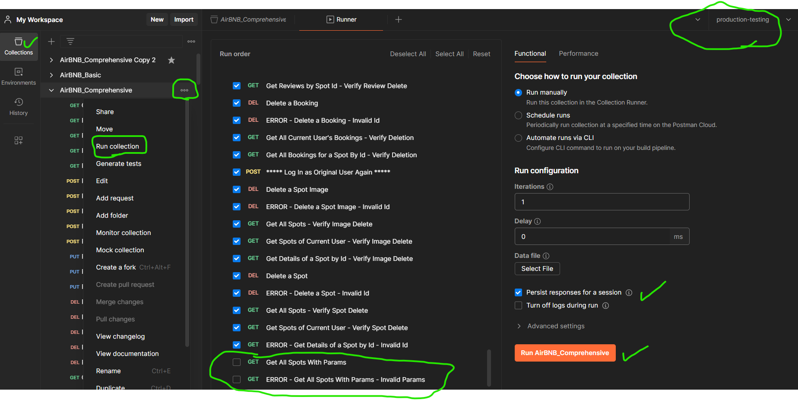

# Using Postman for API Testing

This guide will walk you through importing the collections and setting the environment variables so that you can test your API endpoints with Postman.

Please note the green circles and checkmarks in the screenshots are highlighting important fields that you'll use when working with Postman.

## Import the Collections

Begin by importing the test collections.

There is a basic collection and comphrehensive collection.  You can find them in our Discord or in this repo in the "airbnb" folder, and then "postman-tests".

You can drag and drop the json files, or copy and paste the content into the text box that saus "Paste cURL...".

 
 
 
## Set the Environment Variables

Set the environment variables.  You will have a local enviornment and a production environment.  Be sure to click "Save" after you set the variables.

### Local Environment
This should be localhost:8000/api

 
 
 

### Production Environment
This should be something like: https://my-render-project.onrender.com/api

 
 
 

## Basic Collection ⭐

The basic collection is the most straight forward way to test your endpoints.  You should use this collection for most of your testing until you're further along in the project.

Please note: the basic collection lines up with the scorecard.  This allows you to work through the scorecard in the same order as this Postman collection.

 
 
 

## Comprehensive Collection

The comprehensive collection is what you should use when you're ready to test all of your endpoints.  Uncheck the last two endpoints in the comprehensive collection until you're ready to test query params; this should be the last route you create: refactoring the getAllSpots route to use query params.

