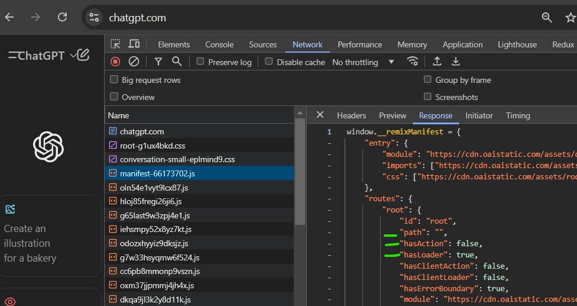

# React Router APIs

Here are the APIs that you will most likely end up using in your React Router projects at App Academy:

- [Link](https://reactrouter.com/en/main/components/link)
- [NavLink](https://reactrouter.com/en/main/components/nav-link)
- [Outlet](https://reactrouter.com/en/main/components/outlet)
- [useParams](https://reactrouter.com/en/main/hooks/use-params)
- [useNavigate](https://reactrouter.com/en/main/hooks/use-navigate)
- [createBrowserRouter](https://reactrouter.com/en/main/routers/create-browser-router)

The above is more than enough to get you going through the curriculum!

I added a few bonus readings and features below that I like using. Occasionally, students will ask me about them or you'll see them in the docs, but they're not required to understand for your project or assessment!

## Bonus Material (Optional Content)

### How Does it Work?

This is an in depth explanation of how React Router works.  It's beyond the scope of this curriculum, but it's a great resource if you're someone who likes to get an idea of how things work under the hood.

https://reactrouter.com/en/main/start/concepts

### Bonus Features

These are RR features that aren't covered in the curriculum, but they're pretty powerful. You may find that after the initial learning curve, they simplify your code and help you understand web fundementals a little better. You'll probably find yourself going to MDN pretty often if you work with these features.

  If you're interested, I recommend coding through the [React Router tutorial](https://reactrouter.com/en/main/start/tutorial) to see the entire dataflow.  It should take 30-45 minutes to go through.

- [Actions](https://reactrouter.com/en/main/route/action)
- [Loaders](https://reactrouter.com/en/main/route/loader)
- [useLoaderData](https://reactrouter.com/en/main/hooks/use-loader-data)
- [useActionData](https://reactrouter.com/en/main/hooks/use-action-data)
- [useFetcher](https://reactrouter.com/en/main/hooks/use-fetcher)
- [useRouteLoaderData](https://reactrouter.com/en/main/hooks/use-route-loader-data)

### Fun fact!

ChatGPTs UI is built with Remix which will be [merging with React Router](https://remix.run/blog/merging-remix-and-react-router) any day now!  Notice how some of these key vals in the below screenshot look familiar to the above APIs: loaders and actions.
 
 

