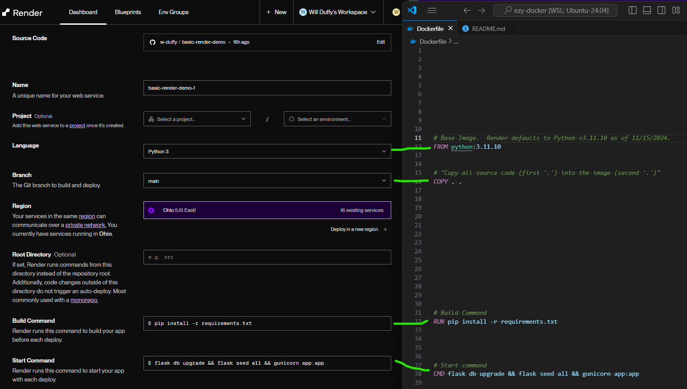

# Ezy Docker

This is a _very simplified_ Dockerfile.  This is intended to roughly compare deploying to render without Docker to deploying to Render with Docker.

---

In the case of adding the Dockerfile to our repo and selecting "Docker" as "Language", Render will use the Dockerfile (right side of the image) to build/start our app instead of the GUI inputs (left side of the image).

## How can this be improved?

- Use a lighter base image

- Optimize the order the instructions so that we utilize Docker's caching mechanisms

- Only copy necessary code into the final image

- Deploy using a prebuilt image from a container image registery such as Docker Hub

- Add CI/CD pipelines, like GH Actions, to automatically to build, test, push our image to a registery, and trigger a deployment

- And more!!
